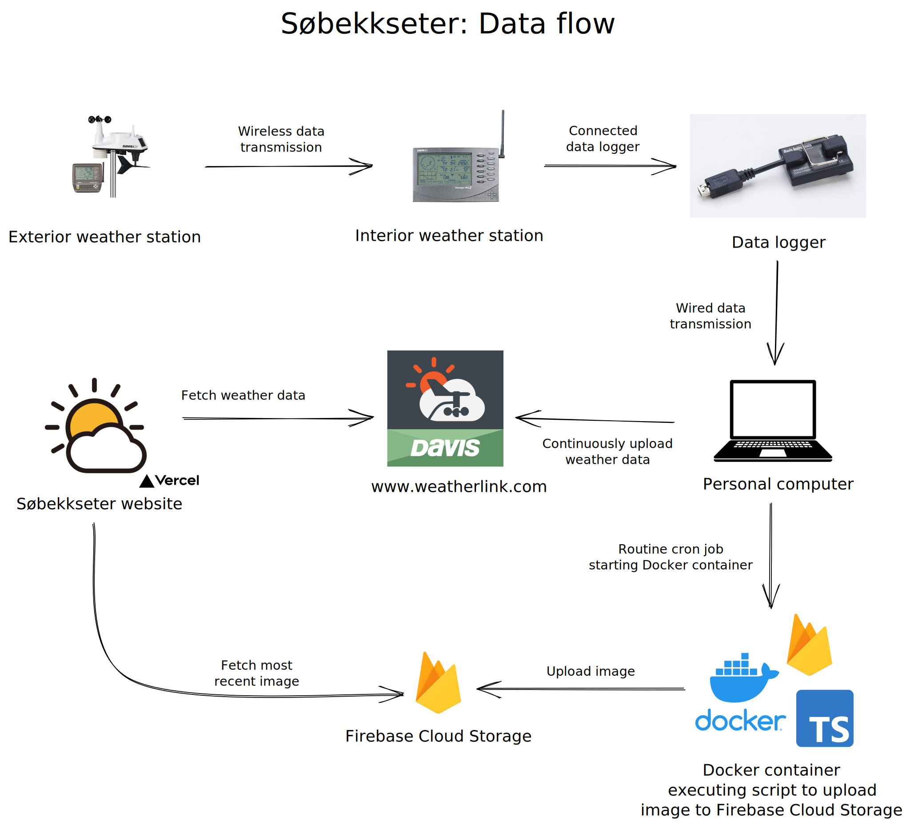

# Været på Søbekseter

## Description ✏️

This project is the official code base for the website [Været på Søbekkseter](sobekkseter.systemsoft.no).

## Data flow 📝



## Developer Information 🙋🏼‍♂️

Developed by Magnus Rødseth.

## Tech Stack 🛠

This project was bootstrapped using the [T3 stack](https://create.t3.gg/). It uses the following technologies:

- [Next.js](https://nextjs.org/)
- [TypeScript](https://www.typescriptlang.org/)
- [Tailwind CSS](https://tailwindcss.com/)

## Running the application ✅

```sh
# Navigate to the project directory
cd sobekkseter

# Install dependencies
pnpm i

# Run the application
pnpm dev
```
