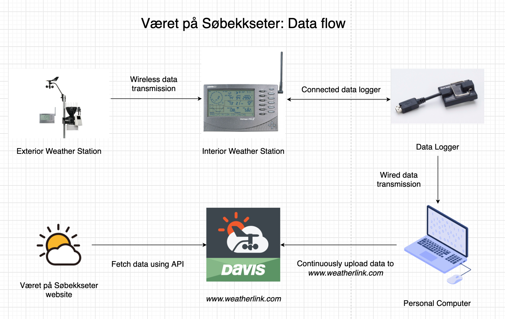

# Været på Søbekkseter ⛅️

## What is Været på Søbekkseter ❓

This project is the official code base for the website [Været på Søbekkseter](https://www.systemsoft.no/Sobekklia/wx.htm).

## An illustration of the data flow ✏️



## Developer information 🙋🏼‍♂️

Developed by Magnus Rødseth and Julian Grande, Summer 2021.

## Tech Stack 🛠

- Next.js
- TypeScript
- React
- Tailwind CSS (Not yet decided CSS framework)

## Running the application locally ⏩

After cloning the repository, navigate to the `sobekkseter` directory. From now on, this will be the root directory `~`.

First, ensure that you have a `.env` file in your `frontend` folder.

**`.env`**

```
# I'd like to see you try to use these credentials

DID=MyD3v1c31D
OWNER_PASSWORD=My0wn3rP455w0rd
TOKEN_ID=MyT0k3n1D
```

Now that you have a valid `.env` file, it's time to run the application.

### With Docker 🐳

First, make sure you have Docker **installed and running** on your computer. Use this [tutorial](https://docs.docker.com/desktop/) if you're having problems.

**`Terminal`**

```shell
# Navigate to the sobekkseter directory (inside the root directory)
cd sobekkseter

# Run the application using Docker
docker-compose up

# OR

# Run the application in detached state using Docker
docker-compose up -d
```

Open your web browser and go to `localhost:3000`. The application should be running!

### Without Docker 📦

If you do not have `yarn` installed globally on your computer, you can use this [tutorial](https://classic.yarnpkg.com/en/docs/install/#mac-stable) for doing so. If you prefer using `npm`, exchange `yarn` with `npm` in the commands below.

**`Terminal`**

```shell
# Navigate to the sobekkseter directory (inside the root directory)
cd sobekkseter

# Install dependencies
yarn install

# Run application in development mode
yarn dev
```

Open your web browser and go to `localhost:3000`. The application should be running!
